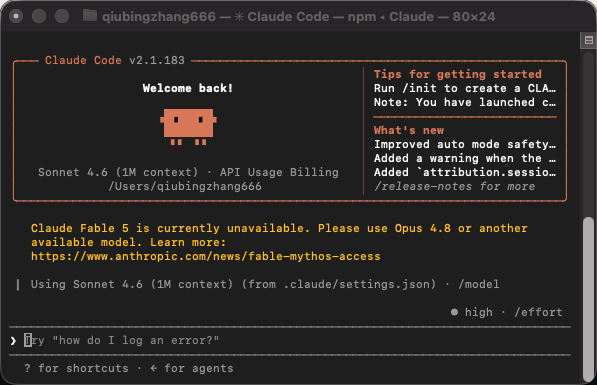
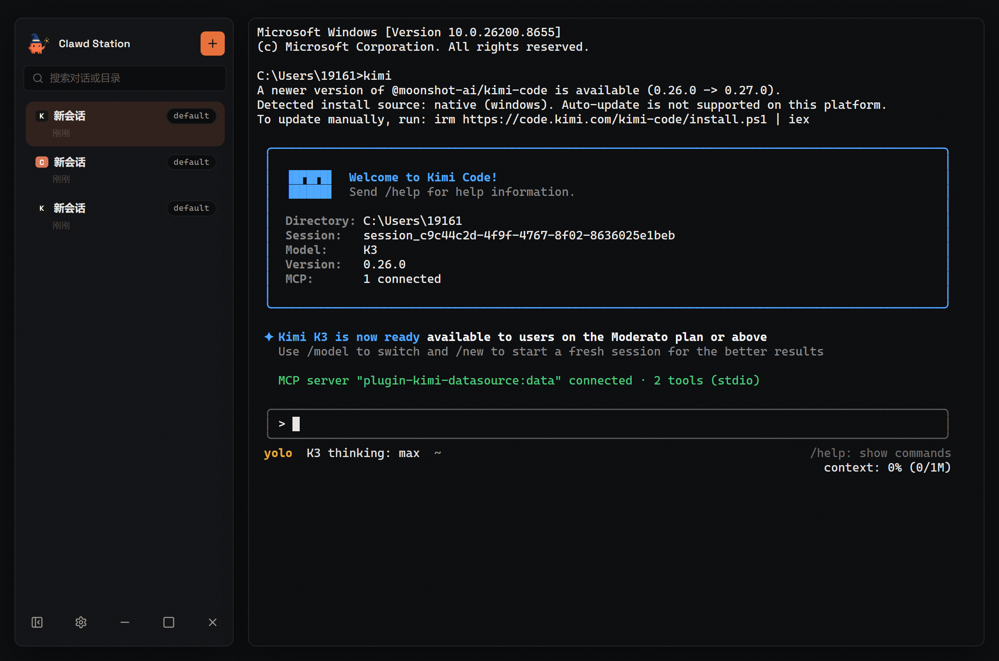
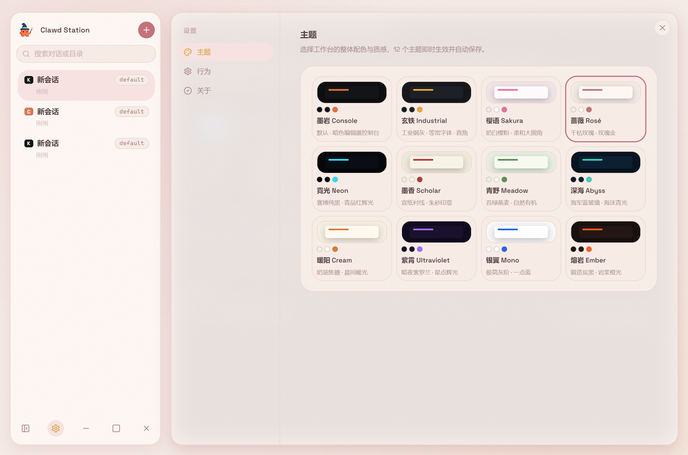
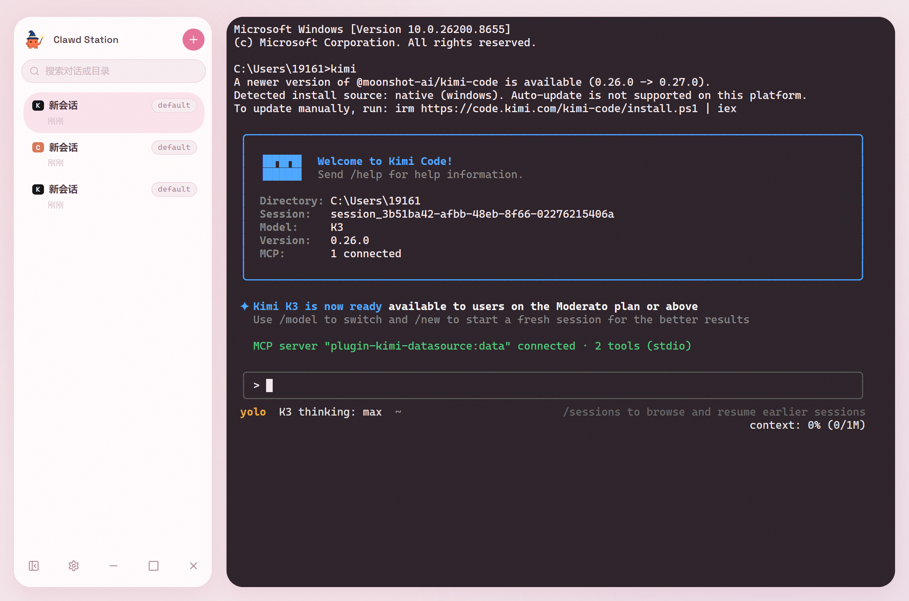
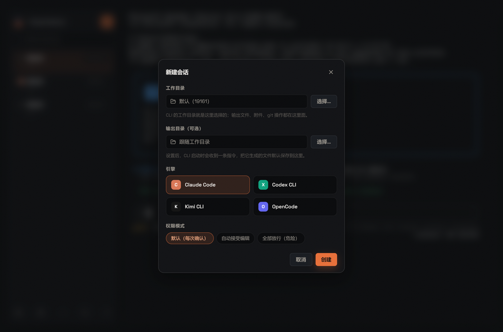

# Clawd Station

把本机的 AI CLI 收进一个安静的桌面工作台。

它不是新的 AI 模型，也不是任何 CLI 的替代品。它只是把你电脑里已经可以运行的 `claude`、`codex`、`opencode`、`kimi` 命令，包进一个更舒服的桌面界面里：多会话管理、真实终端、12 套主题、输出目录，以及更安静的长时间工作体验。

> Unofficial desktop workbench for AI CLIs. Claude and Anthropic are trademarks of Anthropic. This project is not affiliated with or endorsed by Anthropic, OpenAI, or Moonshot AI.

## 界面速览

### 1. 终端里的 Claude Code

AI CLI 原本运行在终端里，信息密度高，也更接近开发者工具本身。



### 2. Clawd Station 工作台

悬浮卡片布局：左侧是会话卡片，右侧是纯净的真实终端。终端里看到的就是 CLI 本身，没有任何转述或裁剪。



### 3. 12 套主题

设置页一键切换，即时生效并自动保存。深色、浅色、工业、赛博、宣纸、自然——总有一款顺眼。





### 4. 新建会话与输出目录

每个会话独立选择引擎和权限模式；可以为会话指定输出目录，AI 生成的文件默认保存到那里。未安装的 CLI 会显示安装引导，可以一键装好。



## 它是什么

Clawd Station 是一个面向个人使用的 AI CLI 桌面工作台。

原本这些 CLI 的体验主要发生在终端里：你输入任务，CLI 输出结果，历史、上下文和多会话管理都比较依赖终端习惯。

这个项目做的事情很简单：给每个会话一个真实的终端（node-pty + xterm.js），再用一层安静的桌面外壳把它们组织起来。

它的目标不是做一个复杂的商业 IDE，而是做一个安静、清楚、可长期使用的个人工作台。

## 功能

### 会话管理

- 新建、搜索、置顶、重命名、删除会话，新会话显示在列表最上方
- 每张会话卡显示引擎图标和权限模式芯片；悬停浮现置顶 / 重命名 / 关于 / 删除
- "关于"面板：查看和修改该会话的工作目录与输出目录
- 删除会话时同步删除本地记录，不碰你的原始文件

### 真实终端

- 每个会话一个 node-pty + xterm.js 终端，CLI 在其中原生运行
- 切换会话不中断正在运行的任务，终端内容实时保留并回放
- 终端数量有 LRU 上限，长时间使用不占内存
- 启动尺寸稳定后才拉起 CLI，全屏 TUI 不会画花

### 12 套主题

墨岩、玄铁、樱语、蔷薇、霓光、墨香、青野、深海、暖阳、紫霄、银翼、熔岩。统一悬浮卡片布局，终端配色跟随主题。

### 动效等级

设置 → 行为 → 动效等级：敏捷 / 标准 / 沉稳。全局所有动画（弹窗、折叠、设置切换、主题渐变）统一跟随。

### 输出目录

为会话指定一个"收件箱"目录（比如桌面）：

- CLI 启动时会自动发送一条指令，让 AI 把生成的文件默认保存到该目录
- 设置时会弹出说明窗：这条指令是一条真实的 AI 消息（产生一次 API 交互）；长对话后 AI 可能淡忘，修改输出目录或重进会话会重新告知
- 不设置则跟随工作目录，行为和直接用 CLI 完全一致

### 引擎安装引导

新建会话时自动检测各 CLI 的安装状态。未安装的引擎会显示引导块，可以复制官方安装命令，或点"立即安装"由应用代为执行（过程输出实时可见）。

### 支持的 AI 引擎

每个会话独立选择引擎。应用本身不提供任何 CLI，也不绕过各 CLI 的登录、权限或计费机制——你终端里能用，它才有可能在这里面用。

| 引擎 | 环境变量 | 默认命令 | 安装 |
|---|---|---|---|
| Claude Code | `CLAUDE_CODE_BIN` / `CLAUDE_BIN` | `claude` | `npm install -g @anthropic-ai/claude-code` |
| Codex CLI | `CODEX_BIN` | `codex` | `npm install -g @openai/codex` |
| Kimi CLI | `KIMI_BIN` | `kimi` | `npm install -g @moonshot-ai/kimi-code` |
| OpenCode | `OPENCODE_BIN` | `opencode` | `npm install -g opencode-ai` |

**权限 / 沙盒** 由每个会话独立选择：

- Claude: `default` / `acceptEdits` / `bypassPermissions`
- Codex: `read-only` / `workspace-write` / `danger-full-access`
- OpenCode: `ask` / `auto`
- Kimi: `default` / `auto` / `yolo`

**会话恢复** 自动捕获每个 CLI 的会话 ID 并在续聊时复用（`--resume` / `exec resume` / `-s`）。

## 本地记录

所有记录都从这个 app 内开始保存：会话列表、transcript、置顶状态、外观设置。

Windows 下默认存储位置：

```
%APPDATA%\Clawd Station\local-records
```

删除会话时，会同步删除该会话相关的本地记录。它不会删除你原始电脑文件。

## 从源码运行

### 1. 克隆项目

```bash
git clone https://github.com/hyfdracula/clawd-station.git
cd clawd-station
```

### 2. 安装依赖

```bash
npm install
```

### 3. 开发模式

先启动 Vite：

```bash
npm run dev
```

再启动 Electron（另一个终端）：

```bash
npm run electron
```

### 4. 测试

```bash
npm test
```

### 5. 构建与打包

```bash
# 构建前端
npm run build

# 打包 Windows（NSIS 安装包 + 便携版 exe，输出到 dist/）
npm run package:win

# 打包 macOS（dmg + zip）
npm run package:mac
```

## 环境变量

### 指定 CLI 命令

```bash
CLAUDE_CODE_BIN=/path/to/claude
```

其余引擎同理：`CODEX_BIN`、`OPENCODE_BIN`、`KIMI_BIN`。

### Mock 模式

用于本地测试 UI，不真实调用 CLI。每个引擎独立开关：

```bash
# 只 mock Claude
CLAUDE_TO_CODE_MOCK=1 npm run electron

# 只 mock Codex / OpenCode
CLAWDS_MOCK_CODEX=1 npm run electron
CLAWDS_MOCK_OPENCODE=1 npm run electron

# 全部 mock
CLAWDS_MOCK_ALL=1 npm run electron
```

### Smoke 测试

需要先启动 `npm run dev`，然后：

```bash
CLAUDE_TO_CODE_MOCK=1 CLAUDE_TO_CODE_SMOKE=1 npm run electron
```

自动完成"新建会话 → 选引擎 → 创建 → 终端挂载"的端到端检查，失败时非零退出。

## 常见问题

### 这是官方客户端吗？

不是。这是一个非官方的桌面壳。它调用你本机已有的 CLI 命令，本身不提供任何 AI 服务。

### 它会额外消耗 token 吗？

界面本身不会额外调用模型。你在会话里的每一次提问，消耗完全等同于直接在终端里使用该 CLI。（唯一的例外：设置了输出目录的会话，启动时会自动发一条目录指令，这是一次真实消息。）

### 删除会话会删除什么？

删除会话会删除左侧会话记录和该会话的本地记录目录。不会删除你原始电脑上的任何文件。

### 支持哪些平台？

Windows 和 macOS。Windows 已实机验证（含 npm 安装的 `.cmd` shim 解析）；macOS 基于同一套 Electron 代码构建。

## 技术栈

- Electron
- React + TypeScript
- Vite
- node-pty + xterm.js
- lucide-react

## Roadmap

- [ ] 更细的权限确认展示
- [ ] 更好的长上下文管理
- [ ] 会话导出
- [ ] Linux 适配

## License

MIT
