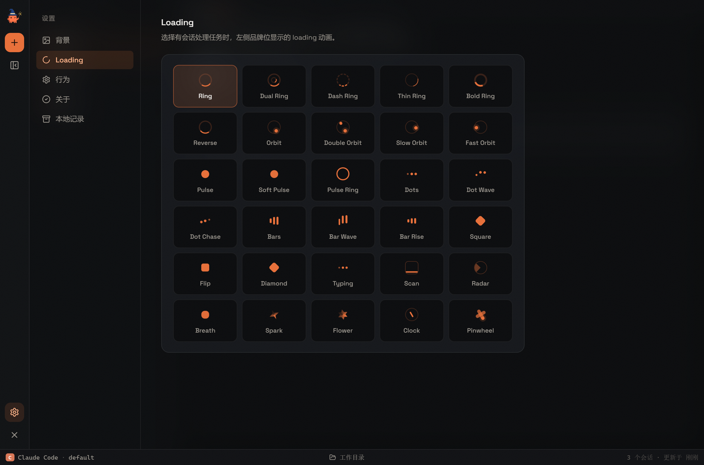

# Clawd Station

把本机的 AI CLI 收进一个安静的暗色桌面工作台。

它不是新的 AI 模型，也不是任何 CLI 的替代品。它只是把你电脑里已经可以运行的 `claude`、`codex`、`opencode`、`kimi` 命令，包进一个更舒服的桌面界面里：多会话管理、真实终端、本地记录、自定义外观，以及更安静的长时间工作体验。

> Unofficial desktop workbench for AI CLIs. Claude and Anthropic are trademarks of Anthropic. This project is not affiliated with or endorsed by Anthropic, OpenAI, or Moonshot AI.

## 界面速览

### 1. 终端里的 Claude Code

AI CLI 原本运行在终端里，信息密度高，也更接近开发者工具本身。


### 2. Clawd Station 工作台

暗色编辑器式布局：左侧是会话面板，主区域是无边框的真实终端，底部状态栏显示引擎、权限模式和工作目录。


### 3. 新建会话与引擎安装引导

每个会话独立选择引擎和权限模式。检测到某个 CLI 未安装时，可以直接在弹窗里查看安装命令，或点"立即安装"让应用帮你装好。


### 4. Loading 动画

有会话在处理任务时，左侧品牌位可以显示不同的 Loading 动画，内置 28 种样式。



## 它是什么

Clawd Station 是一个面向个人使用的 AI CLI 桌面工作台。

原本这些 CLI 的体验主要发生在终端里：你输入任务，CLI 输出结果，历史、上下文和多会话管理都比较依赖终端习惯。

这个项目做的事情很简单：给每个会话一个真实的终端（node-pty + xterm.js），再用一层安静的桌面外壳把它们组织起来。你在终端里看到的就是 CLI 本身，没有任何转述或裁剪。

你可以在里面：

- 新建多个会话，每个会话独立运行一个 CLI 实例
- 搜索、置顶、重命名、删除会话
- 切换会话不中断正在运行的任务，终端内容实时保留
- 为每个会话选择工作目录
- 切换界面主题、Loading 动画和关闭行为
- 最小化到系统托盘，持续在后台运行

它的目标不是做一个复杂的商业 IDE，而是做一个安静、清楚、可长期使用的个人工作台。

## 支持的 AI 引擎

每个会话独立选择引擎。应用本身不提供任何 CLI，也不绕过各 CLI 的登录、权限或计费机制——你终端里能用，它才有可能在这里面用。

| 引擎 | 环境变量 | 默认命令 | 安装 |
|---|---|---|---|
| Claude Code | `CLAUDE_CODE_BIN` / `CLAUDE_BIN` | `claude` | `npm install -g @anthropic-ai/claude-code` |
| Codex CLI | `CODEX_BIN` | `codex` | `npm install -g @openai/codex` |
| Kimi CLI | `KIMI_BIN` | `kimi` | `npm install -g @moonshot-ai/kimi-code` |
| OpenCode | `OPENCODE_BIN` | `opencode` | `npm install -g opencode-ai` |

**安装引导**：新建会话时，应用会自动检测各 CLI 的安装状态。未安装的引擎会显示引导块，可以复制官方安装命令，或点"立即安装"由应用代为执行（过程输出实时可见）。

**权限 / 沙盒** 由每个会话独立选择：

- Claude: `default` / `acceptEdits` / `bypassPermissions`
- Codex: `read-only` / `workspace-write` / `danger-full-access`
- OpenCode: `ask` / `auto`
- Kimi: `default` / `auto` / `yolo`

**会话恢复** 自动捕获每个 CLI 的会话 ID 并在续聊时复用（`--resume` / `exec resume` / `-s`）。

## 会话与本地记录

- 会话列表支持搜索、置顶、重命名、删除
- 每个会话显示引擎角标和更新时间
- 终端内容有回放缓冲：切换会话、折叠面板都不会丢失正在运行的输出
- 删除会话时，同步删除该会话的本地 transcript 和记录目录，不会删除你的原始文件

Windows 下默认存储位置：

```
%APPDATA%\Clawd Station\local-records
```

## 外观设置

设置页包含：

- 12 套界面主题（即时生效并自动保存）
- 28 种 Loading 动画
- 关闭按钮行为（直接退出 / 最小化到托盘）
- 版本与自动更新（打包版从 GitHub Releases 检查更新）

## 从源码运行

### 1. 克隆项目

```bash
git clone https://github.com/hyfdracula/clawd-station.git
cd clawd-station
```

### 2. 安装依赖

```bash
npm install
```

### 3. 开发模式

先启动 Vite：

```bash
npm run dev
```

再启动 Electron（另一个终端）：

```bash
npm run electron
```

### 4. 测试

```bash
npm test
```

### 5. 构建与打包

```bash
# 构建前端
npm run build

# 打包 Windows（NSIS 安装包 + 便携版 exe，输出到 dist/）
npm run package:win

# 打包 macOS（dmg + zip）
npm run package:mac
```

## 环境变量

### 指定 CLI 命令

```bash
CLAUDE_CODE_BIN=/path/to/claude
```

其余引擎同理：`CODEX_BIN`、`OPENCODE_BIN`、`KIMI_BIN`。

### Mock 模式

用于本地测试 UI，不真实调用 CLI。每个引擎独立开关：

```bash
# 只 mock Claude
CLAUDE_TO_CODE_MOCK=1 npm run electron

# 只 mock Codex / OpenCode
CLAWDS_MOCK_CODEX=1 npm run electron
CLAWDS_MOCK_OPENCODE=1 npm run electron

# 全部 mock
CLAWDS_MOCK_ALL=1 npm run electron
```

### Smoke 测试

需要先启动 `npm run dev`，然后：

```bash
CLAUDE_TO_CODE_MOCK=1 CLAUDE_TO_CODE_SMOKE=1 npm run electron
```

自动完成"新建会话 → 选引擎 → 创建 → 终端挂载"的端到端检查，失败时非零退出。

## 常见问题

### 这是官方客户端吗？

不是。这是一个非官方的桌面壳。它调用你本机已有的 CLI 命令，本身不提供任何 AI 服务。

### 它会额外消耗 token 吗？

界面本身不会额外调用模型。你在会话里的每一次提问，消耗完全等同于直接在终端里使用该 CLI。

### 删除会话会删除什么？

删除会话会删除左侧会话记录、该会话的本地 transcript 和记录目录。不会删除你原始电脑上的任何文件。

### 支持哪些平台？

Windows 和 macOS。Windows 已实机验证（含 npm 安装的 `.cmd` shim 解析）；macOS 基于同一套 Electron 代码构建。

## 技术栈

- Electron
- React + TypeScript
- Vite
- node-pty + xterm.js
- lucide-react

## Roadmap

- [ ] 更细的权限确认展示
- [ ] 更好的长上下文管理
- [ ] 会话导出
- [ ] Linux 适配

## License

MIT
