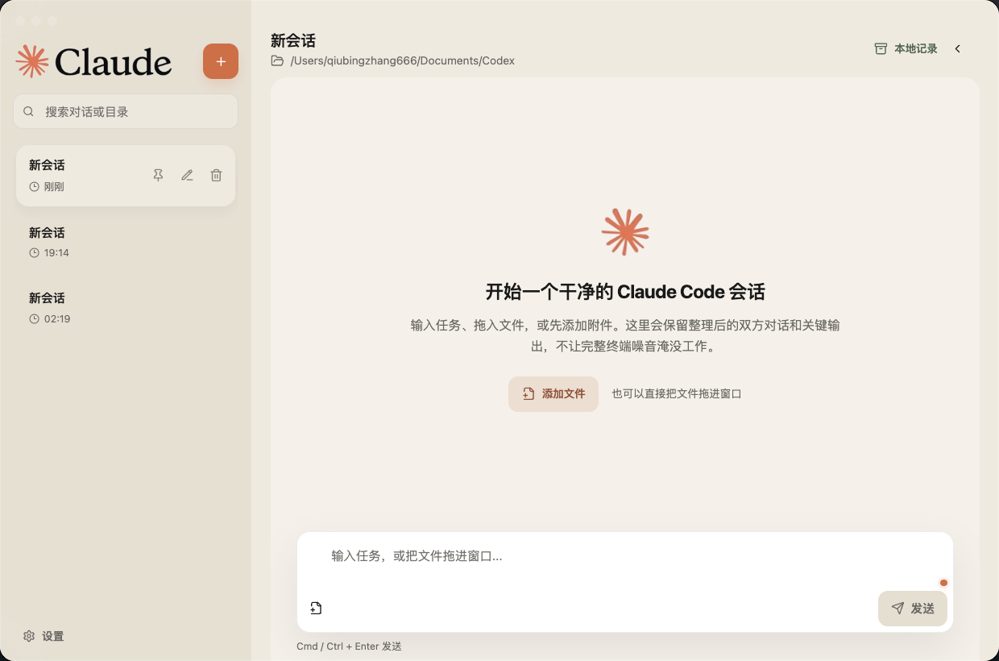
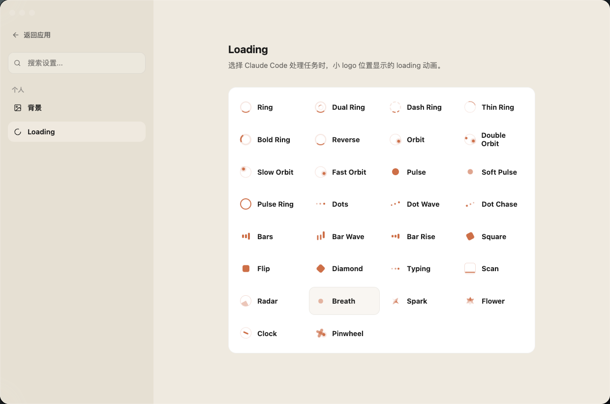
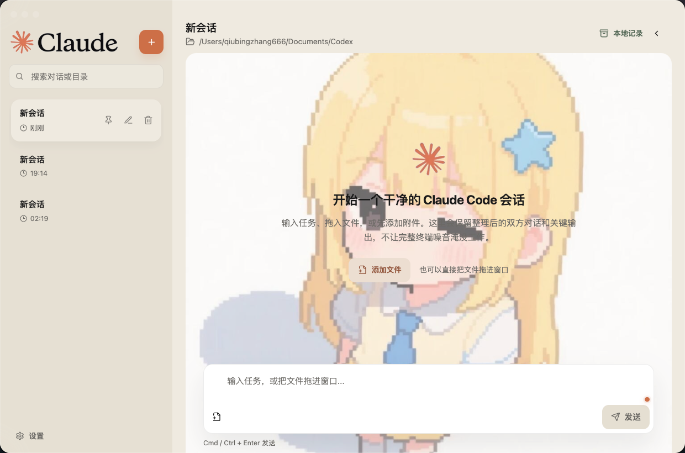

# Claude to Code

一个把 Claude Code 终端对话整理成桌面工作台的个人客户端壳。

它不是新的 AI 模型，也不是 Claude Code 的替代品。它只是把你电脑里已经可以运行的 `claude` 命令，包进一个更舒服的桌面界面里：多会话、本地记录、附件拖拽、聊天式阅读、自定义背景，以及更安静的对话体验。

> Unofficial desktop shell for Claude Code. Claude and Anthropic are trademarks of Anthropic. This project is not affiliated with or endorsed by Anthropic.

## 界面速览

### 1. 终端里的 Claude Code

Claude Code 原本运行在终端里，信息密度高，也更接近开发者工具本身。


### 2. Claude to Code 桌面工作台

Claude to Code 把 Claude Code 对话整理成更安静的桌面界面：左侧管理会话，主区域保留对话和关键输出，底部固定输入任务。



### 3. Loading 动画选择

处理任务时，小 logo 位置可以显示不同 Loading 动画。设置页内置数十种动画样式。



### 4. 背景图片、视频和透明度

对话区支持自定义背景颜色、任意图片和任意视频，也可以调节透明度，让工作区更接近自己的使用习惯。




### 5. 快速回到上一条请求

发送键上方的红点用于快速跳到最近的一条用户请求，连续点击可以一路回看更早的请求。


## 它是什么

Claude to Code 是一个面向个人使用的 Claude Code 桌面客户端。

原本 Claude Code 的体验主要发生在终端里：你输入任务，Claude Code 输出结果，历史、文件、上下文和多会话管理都比较依赖终端习惯。

这个项目做的事情很简单：把 Claude Code 的终端工作流整理成一个类似聊天软件和桌面工作台之间的界面。

你可以在里面：

- 新建多个 Claude Code 会话
- 搜索、置顶、重命名、删除会话
- 查看本地 transcript
- 拖入文件并随任务一起传给 Claude Code
- 使用固定在底部的输入框发送任务
- 通过右键菜单复制、粘贴、选择单条消息
- 自定义对话区背景颜色、图片、视频和透明度
- 在 Claude Code 处理中看到加载动画
- 让输出以更接近流式的方式逐步出现，而不是突然出现一整段

它的目标不是做一个复杂的商业 IDE，而是做一个安静、清楚、可长期使用的个人工作台。

## 功能

### 会话管理

- 新建对话
- 搜索历史对话
- 置顶对话
- 重命名对话
- 删除对话
- 每个对话显示标题和更新时间
- 删除时同步删除本地 transcript 和附件记录

### Claude Code 连接

默认调用本机命令：

```bash
claude
```

也可以通过环境变量指定 Claude Code 路径：

```bash
CLAUDE_CODE_BIN=/path/to/claude
```

或：

```bash
CLAUDE_BIN=/path/to/claude
```

应用本身不提供 Claude Code，也不绕过 Claude Code 的登录、权限或计费机制。你终端里能用，它才有可能在这里面用。

### 支持的 AI 引擎

每个会话独立选择引擎，配置通过环境变量指定二进制路径。

| 引擎 | 环境变量 | 默认 | JSON 输出 | 附件 |
|---|---|---|---|---|
| Claude Code | `CLAUDE_CODE_BIN` / `CLAUDE_BIN` | `claude` | `--output-format stream-json` | 走 prompt 文本 |
| Codex CLI | `CODEX_BIN` | `codex` | `exec --json` | `--image`（图片）；文本附件追加到 prompt |
| OpenCode | `OPENCODE_BIN` | `opencode` | `run --format json` | `--file`（任意） |

新建会话时弹出引擎 + 权限模式 picker；侧栏小角标显示每个会话的引擎（`C` / `X` / `O`）。

**Codex 鉴权** 走 `~/.codex/config.toml`（不要在 `.env` 里写 `OPENAI_API_KEY`，会盖掉 Codex 自带的 relay provider）。

**权限 / 沙盒** 由每个会话独立选择：

- Claude: `default` / `acceptEdits` / `bypassPermissions`
- Codex: `read-only` / `workspace-write` / `danger-full-access`
- OpenCode: `ask` / `auto`

**会话恢复** 自动捕获每个 CLI 的会话 ID 并复用：

- Claude: `--resume <claudeSessionId>`
- Codex: `exec resume <codexSessionId>`（thread_id）
- OpenCode: `-s <opencodeSessionId>`（sessionID）

### 对话体验

- 用户消息和 Claude Code 回复分开展示
- 自动过滤部分终端噪音
- 代码块单独显示
- 默认打开会话时滚动到底部
- 支持右键复制、粘贴、选择单条消息
- 支持跳转到上一条用户消息，方便回看长对话
- Claude Code 输出会逐步出现，阅读体验更接近流式输出

### 附件

- 点击加号选择本地文件
- 支持拖拽文件进窗口
- 附件会复制到当前会话的本地附件目录
- 发送时会把附件路径一起传给 Claude Code
- 可以移除待发送附件

### 本地记录

所有记录都从这个 app 内开始保存。

本地保存内容包括：

- 会话列表
- 每个会话的 transcript
- 附件记录
- 置顶状态
- 更新时间
- 外观设置

macOS 下默认存储位置大致在：

```bash
~/Library/Application Support/Claude to Code/local-records
```

删除会话时，会同步删除该会话相关的本地记录和附件目录。它不会删除你原始电脑文件，只删除 app 复制进本地记录目录里的附件副本。

### 外观设置

设置页目前包含：

- 对话框背景颜色
- 背景透明度
- 自定义背景图片
- 自定义背景视频
- Loading 动画选择

## 下载

最新版本可以直接下载：

[Claude-to-Code-macOS.zip](https://github.com/1499374741-arch/claude-to-code/releases/download/v0.1.0/Claude-to-Code-macOS.zip)

也可以在 GitHub Releases 页面里下载：

[Claude to Code v0.1.0](https://github.com/1499374741-arch/claude-to-code/releases/tag/v0.1.0)

下载后解压，双击打开即可。

如果 macOS 提示“无法打开，因为无法验证开发者”，可以在系统设置里允许打开，或者在终端执行：

```bash
xattr -cr "/Applications/Claude to Code.app"
```

然后重新打开。

## 使用前准备

你需要先安装并登录 Claude Code。

确认终端里可以正常运行：

```bash
claude
```

如果终端里都不能运行，这个 app 里也不会成功。

如果你的 `claude` 不在普通 shell 路径里，可以这样启动应用：

```bash
CLAUDE_CODE_BIN="/your/path/to/claude" open "/Applications/Claude to Code.app"
```

## 从源码运行

### 1. 克隆项目

```bash
git clone https://github.com/1499374741-arch/claude-to-code.git
cd claude-to-code
```

### 2. 安装依赖

```bash
npm install
```

### 3. 开发模式

先启动 Vite：

```bash
npm run dev
```

再启动 Electron：

```bash
npm run electron
```

### 4. 构建

```bash
npm run build
```

### 5. 打包 macOS app

```bash
node work/package-app.cjs
```

生成位置：

```bash
outputs/Claude to Code.app
```

## 环境变量

### 指定 Claude Code 命令

```bash
CLAUDE_CODE_BIN=/path/to/claude
```

备用：

```bash
CLAUDE_BIN=/path/to/claude
```

### Mock 模式

用于本地测试 UI，不真实调用 CLI。每个引擎独立开关：

```bash
# 只 mock Claude
CLAUDE_TO_CODE_MOCK=1 npm run electron

# 只 mock Codex
CLAWDS_MOCK_CODEX=1 npm run electron

# 只 mock OpenCode
CLAWDS_MOCK_OPENCODE=1 npm run electron

# 三个全 mock
CLAWDS_MOCK_ALL=1 npm run electron
```

旧变量仍然兼容：

```bash
CLAUDE_WORKBENCH_MOCK=1 npm run electron
```

Mock 模式下，Codex 会按真实 `exec --json` 事件格式吐 `item.completed.agent_message` 块；OpenCode 会按 `run --format json` 吐带 `<think>` 块的 `text` 事件（自动剥离）。适合没装对应 CLI 的机器演示或 CI 跑端到端。

### Smoke 测试

```bash
CLAUDE_TO_CODE_MOCK=1 CLAUDE_TO_CODE_SMOKE=1 npm run electron
```

## 常见问题

### 这是 Claude 官方客户端吗？

不是。

这是一个非官方的 Claude Code 桌面壳。它调用你本机已有的 Claude Code 命令，本身不提供 Claude 服务。

### 它会额外消耗 token 吗？

界面本身不会额外调用模型。

但当你发送任务时，应用会把当前任务、必要的上下文和附件路径传给 Claude Code。这些内容进入 Claude Code 后，是否消耗 token 取决于 Claude Code 本身的执行方式。

### 为什么需要本地记录？

因为 Claude Code 原本更偏终端工作流。这个 app 需要自己保存从这里发起的会话、附件和整理后的 transcript，方便你之后回看和继续工作。

### 删除会话会删除什么？

删除会话会删除：

- 左侧会话记录
- 该会话 transcript
- 该会话附件目录
- 本地保存的相关记录

不会删除你原始电脑文件，只删除 app 复制进本地记录目录里的附件副本。

### 支持 Windows 吗？

目前主要面向 macOS。代码基于 Electron，理论上可以适配 Windows 和 Linux，但还没有作为正式目标测试。

## 技术栈

- Electron
- React
- TypeScript
- Vite
- lucide-react

## 开发目标

这个项目的方向不是做复杂 IDE，也不是做团队协作平台。

它更像一个个人 Claude Code 桌面工作台：

- 少一点终端噪音
- 多一点可读性
- 保留本地路径和文件能力
- 让长期对话更容易管理
- 让 Claude Code 的使用体验更像一个安静的桌面应用

## Roadmap

- [ ] 更完整的 Release 打包流程
- [ ] 自动更新
- [ ] 更细的权限确认展示
- [ ] 更好的长上下文管理
- [ ] 会话导出
- [ ] 更多 Loading 动画
- [ ] Windows / Linux 适配

## License

MIT
